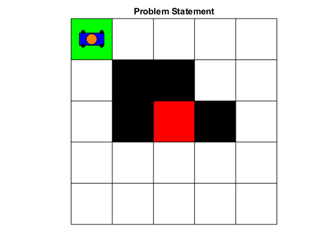
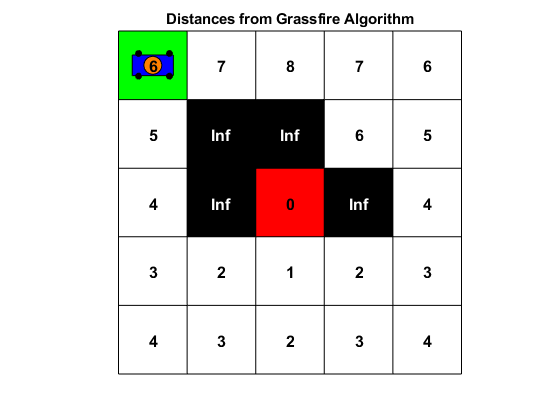
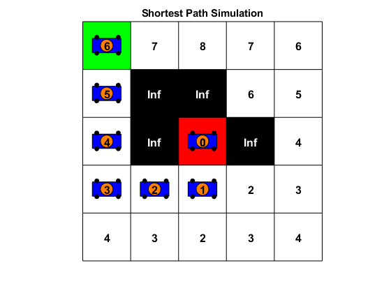

# Grassfire Pathfinding Algorithm Simulation

This project implements the Grassfire Algorithm for pathfinding in a grid-based environment, simulating the movement of a robot from a start cell to a goal cell while avoiding obstacles. The simulation visualizes the grid, the distances calculated by the Grassfire algorithm, and the shortest path found.

## Table of Contents
- [Introduction](#introduction)
- [Features](#features)
- [Requirements](#requirements)
- [Usage](#usage)
  - [Parameters](#parameters)
  - [Example](#example)
- [File Structure](#file-structure)
- [Results](#results)
  - [Calculated Distances from Grassfire Algorithm](#calculated-distances-from-grassfire-algorithm)
  - [Shortest Path](#shortest-path)
  - [Shortest Path Simulation](#shortest-path-simulation)
- [License](#license)
- [Acknowledgments](#acknowledgments)
- [References](#references)

## Introduction
This project implements a robot pathfinding simulation using a grid-based approach. It utilizes the Grassfire algorithm to compute distances from a goal cell and visualize the shortest path from a specified start cell to the goal while avoiding obstacles.

## Features
- **Grid Visualization**: Displays a grid with start, goal, and obstacle cells.
- **Distance Calculation**: Implements the Grassfire algorithm to calculate distances from the goal to each cell.
- **Shortest Path Simulation**: Visualizes the robot's movement along the shortest path to the goal.
- **Robot Representation**: The robot is represented as a blue rectangle with wheels and an orange top mount.
- **MATLAB Graphics**: Utilizes MATLAB’s graphical capabilities to create an interactive simulation experience.

## Requirements
- MATLAB (preferably R2018b or later)

## Usage
Clone this repository and run the `start_simulation.m` file, providing the grid dimensions, start cell, goal cell, and obstacles as input parameters.

### Parameters
To run the simulation, call the `start_simulation` function with the appropriate parameters:

```matlab
start_simulation(m, n, startCell, goalCell, obstacles)
```

- `m`: Number of rows in the grid.
- `n`: Number of columns in the grid.
- `startCell`: Linear index of the start cell.
- `goalCell`: Linear index of the goal cell.
- `obstacles`: Array of linear indices representing obstacle cells.

### Example

```matlab
m = 5; % Number of rows
n = 5; % Number of columns
startCell = 1; % Start cell index
goalCell = 13; % Goal cell index
obstacles = [7, 8, 12, 14]; % Obstacle cells

start_simulation(m, n, startCell, goalCell, obstacles);
```

## File Structure
The project consists of the following MATLAB functions:
- `start_simulation.m`: The main function that initiates the simulation.
- `display_grid.m`: Displays the grid with the start, goal, and obstacle cells.
- `grassfire_algorithm.m`: Implements the Grassfire algorithm to calculate distances.
- `display_distances.m`: Displays the distances on the grid.
- `shortest_path.m`: Visualizes the robot's path from the start to the goal cell.
- `draw_robot.m`: Draws the robot's representation on the grid.

## Results

### Calculated Distances from Grassfire Algorithm


### Shortest Path


### Shortest Path Simulation


## License
This project is licensed under the MIT License. See the LICENSE file for details.

## Acknowledgments
- Inspired by algorithms for pathfinding and robotics.

## References
1. **Grassfire Algorithm**:
   - H. Edelsbrunner, "Algorithms in Combinatorial Geometry," Springer-Verlag, 1987.
   - [Wikipedia: Grassfire algorithm](https://en.wikipedia.org/wiki/Grassfire_transform)

2. **Pathfinding Algorithms**:
   - R. Hart, N. Nilsson, and B. Raphael, "A Formal Basis for the Heuristic Determination of Minimum Cost Paths," *IEEE Transactions on Systems Science and Cybernetics*, vol. 4, no. 2, pp. 100-107, 1968.

3. **Mobile Robots**:
   - B. Siciliano et al., *Springer Handbook of Robotics*, 2nd ed. Springer, 2016.
   - R. Siegwart, I. R. Nourbakhsh, and D. Scaramuzza, *Introduction to Autonomous Mobile Robots*, 2nd ed. MIT Press, 2011.

4. **MATLAB Graphics**:
   - MATLAB Documentation: [Graphics](https://www.mathworks.com/help/matlab/graphics.html)
